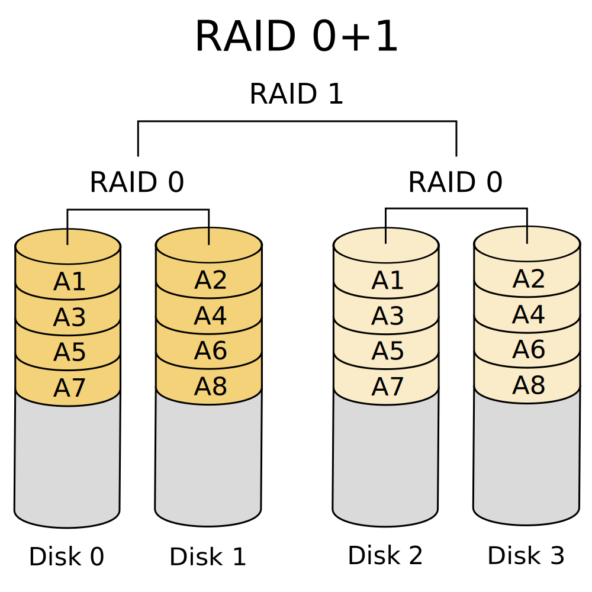
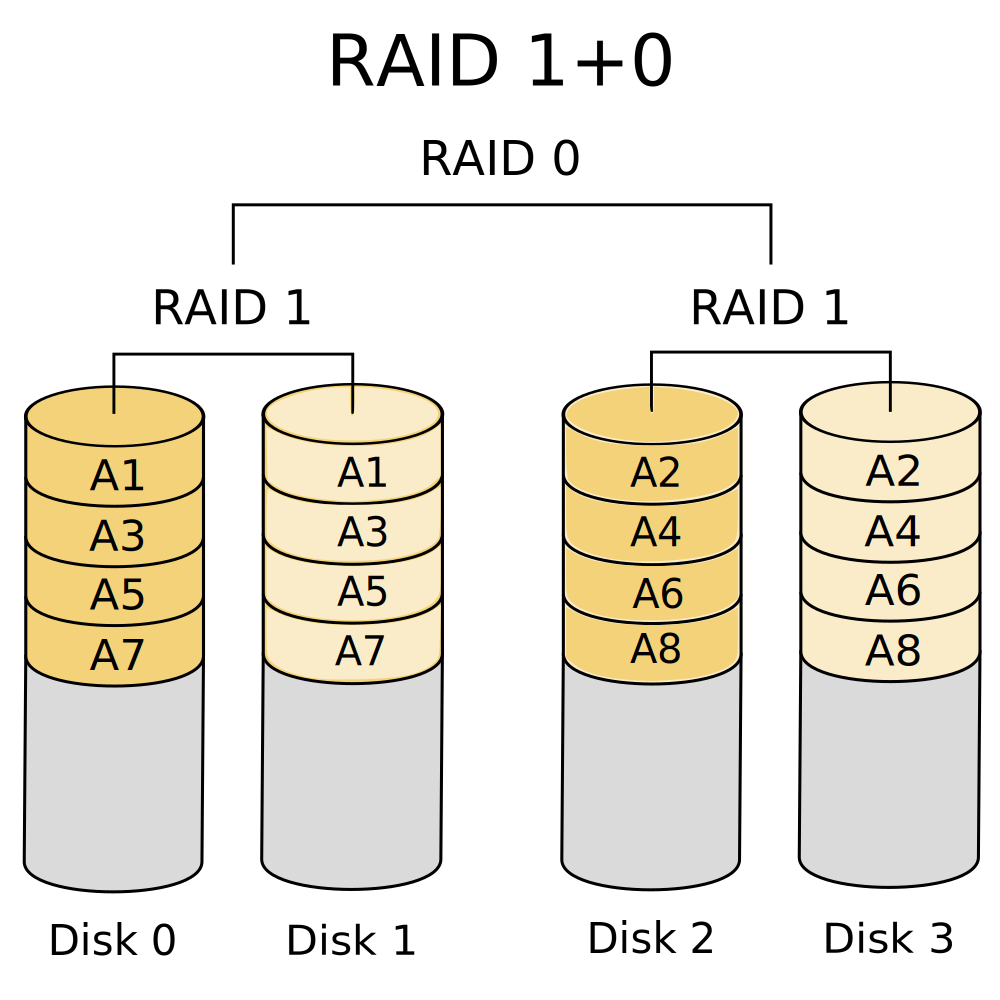

**RAID - Arreglo de Discos Independientes Redundantes**

Conjunto de discos que trabajan como un solo volumen lógico, para brindar redundancia de datos, mejoras en el rendimiento, o ambos.

Los datos se distribuyen en los discos en alguna de varias maneras, que se conocen como niveles de *RAID*. Cada nivel brinda un balance diferente entre los objetivos principales: *confiabilidad*, *disponibilidad*, *rendimiento* y *capacidad*.

Por lo general, se utilizan discos iguales (misma marca, mismo modelo) para componer el arreglo.

**RAID 0** ***(Stripping)***

> By en:User:Cburnett - Own work  This W3C-unspecified vector image was created with Inkscape., CC BY-SA 3.0, https://commons.wikimedia.org/w/index.php?curid=1509075

Mínimo 2 discos.

Separación en tiras (*stripping*), sin espejo (*mirroring*) ni paridad.

La capacidad de este arreglo es la suma de las capacidades de los discos. Ej: Dos discos de 1TB dan un arreglo de 2TB.

Si falla un disco del arreglo se pierden todos los datos.

El beneficio de este arreglo es el rendimiento de las operaciones de lectura y escritura: en principio se multiplica el rendimiento de cada disco por la cantidad de discos que componen el arreglo.

**RAID 1** ***(Mirroring)***

> By en:User:Cburnett - Own work  This W3C-unspecified vector image was created with Inkscape., CC BY-SA 3.0, https://commons.wikimedia.org/w/index.php?curid=1509082

Mínimo 2 discos. Siempre cantidad par de discos en el arreglo.

Espejado (*mirroring*) de los datos, sin separación en tiras (*stripping*) ni paridad.

La capacidad de este arreglo es la mitad de la suma de las capacidades de los discos. Ej: Dos discos de 1TB dan un arreglo de 1TB.

Si falla un disco del arreglo no se pierde ningún dato (la otra mitad del arreglo, tiene todos los datos).

El beneficio de este arreglo es la alta tolerancia a fallos. También se beneficia el rendimiento de las operaciones de lectura (el disco que tiene "más disponible" el dato es el que lo proporciona). Sin embargo, las operaciones de escritura son (un poco) más lentas ya que hay que escribir la copia en cada mitad de los discos del arreglo.

**RAID 5** ***(Distributed Parity)***

> By en:User:Cburnett - Own work  This W3C-unspecified vector image was created with Inkscape., CC BY-SA 3.0, https://commons.wikimedia.org/w/index.php?curid=1509158

Mínimo 3 discos (2 de datos + 1 de paridad).

Separación en tiras a nivel de bloque (*block-level stripping*) con paridad distribuída, sin espejado (*mirroring*).

La capacidad de este arreglo es la suma de la capacidad de los discos que componen el conjunto de datos. Ej: Tres discos de 1TB dan un arreglo de 2TB.

El beneficio de este arreglo es que frente a la falla de uno de los discos, el arreglo puede seguir operando (como en el *RAID1*), sin pérdida de datos (se usa la información de paridad para reconstruir los datos cuando haga falta), y con la ventaja de rendimiento de lectura y escritura (aunque un poco menos en este caso, porque hay que calcular la paridad) del *RAID0*.

Sin embargo, para reconstruir el arreglo después del fallo de un disco, se necesita leer la todos los datos de todos los discos, lo cual puede causar la pérdida total del arreglo si falla un segundo disco mientras se reconstruye el arreglo.

**Arreglos Andidados (Híbridos)**

Los elementos del *RAID* pueden ser discos individuales u otros arreglos *RAID*. Por lo general, no se anidan más de un nivel. Estos arreglos siempre se conforman con una cantidad par de discos y buscan combinar los beneficios de los niveles *RAID* que se anidan (con un costo mayor, ya que se necesitan más discos).

**RAID 0+1** ***(Mirror of Stripes)***

> By Wheart, based on image File:RAID 0.svg by Cburnett - Own work, CC BY-SA 3.0, https://commons.wikimedia.org/w/index.php?curid=6411849

Mínimo 4 discos.

La capacidad de este arreglo es la mitad de la suma de las capacidades de los discos. Ej: Cuatro discos de 1TB dan un arreglo de 2TB.

Se crean dos stripes y se hace un mirror de ambos. Si falla un solo disco, entonces uno de los mirror falló. En este punto se comporta efectivamente como *RAID0* sin redundancia. En la reconstrucción del arreglo tiene más riesgo que *RAID 1+0* ya que se deben leer todos los datos de todos los discos de la tira que queda.

**RAID 1+0 (RAID 10)** ***(Stripping of Mirrors)***

> By NudelSuppe, basierend auf RAID 01 von Cburnett - Own work, CC BY 3.0, https://commons.wikimedia.org/w/index.php?curid=22591138

Mínimo 4 discos.

La capacidad de este arreglo es la mitad de la suma de las capacidades de los discos. Ej: Cuatro discos de 1TB dan un arreglo de 2TB.

Se crea un mirror y se hace un stripe del mirror. El arreglo puede sostener la falla de más de un disco siempre y cuando ningún mirror pierda todos sus discos.

De acuerdo a las especificaciones del fabricante y a benchmarks oficiales independientes, en la mayoría de los casos *RAID 10* ofrece mejor rendimiento y latencia que todos los otros niveles *RAID* excepto *RAID0* (que gana en rendimiento). Es por esto, que este arreglo es el preferido para aplicaciones intensivas de entrada y salida (*I/O-intensive*): servidores de bases de datos, servidores web y de correo electrónico, así como también cualquier otro uso que requiere alto rendimiento del sistema de discos.

> Fuente: Wikipedia. https://en.wikipedia.org/wiki/RAID, https://en.wikipedia.org/wiki/Standard_RAID_levels, https://en.wikipedia.org/wiki/Nested_RAID_levels